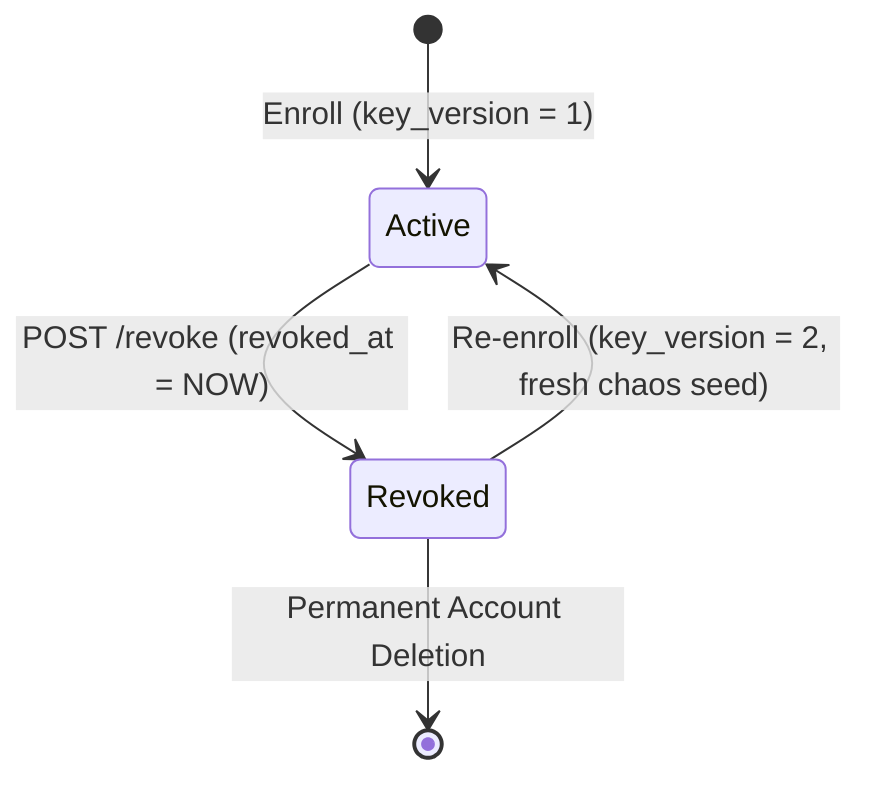

# Database Architecture & Schema Specification

**Target Database**: PostgreSQL 16 (production and Docker Compose); SQLite with `check_same_thread=False` for unit/integration testing.
**ORM & Migrations**: SQLAlchemy 2.0 (`Mapped`, `mapped_column`) with Alembic versioning.

---

## 1. Schema Tables

### Table: `users`
Represents an enrolled identity in the system.
| Column | Type | Constraints | Description |
|---|---|---|---|
| `id` | `UUID` | Primary Key, default `uuid4` | Unique internal user identifier. |
| `username` | `VARCHAR(64)` | Unique, Indexed, Non-null | Unique human-readable handle. |
| `key_mode` | `VARCHAR(32)` | Non-null, default `'user_secret'` | Security mode: `'user_secret'` or `'server_key'`. |
| `key_version` | `INTEGER` | Non-null, default `1` | Current active key version counter. Incremented on revocation. |
| `active` | `BOOLEAN` | Non-null, default `True` | Account status flag. |
| `created_at` | `TIMESTAMPTZ` | Non-null, UTC | Timestamp of account registration. |

### Table: `templates`
Stores cancelable biometric binary hashes ($m$ bits packed into bytes).
| Column | Type | Constraints | Description |
|---|---|---|---|
| `id` | `UUID` | Primary Key, default `uuid4` | Unique template identifier. |
| `user_id` | `UUID` | FK (`users.id`), Indexed, Non-null | Owning user reference. |
| `key_version` | `INTEGER` | Non-null | Key version under which this template was hashed. |
| `template_bytes` | `BYTEA / BLOB` | Non-null | Compact bit-packed binary hash ($m/8$ bytes; 64 bytes for $m=512$). |
| `m` | `INTEGER` | Non-null, default `512` | Dimensionality of hash bit-length. |
| `algo_version` | `VARCHAR(32)` | Non-null, default `'chaoshash-v1'` | Cryptographic / chaos projection version. |
| `created_at` | `TIMESTAMPTZ` | Non-null, UTC | Timestamp when template was generated. |
| `revoked_at` | `TIMESTAMPTZ` | Nullable | Revocation timestamp. `NULL` indicates currently active. |

**Indexes**:
- `ix_templates_user_active`: Composite index on `(user_id, revoked_at)` for rapid active-template lookup.

### Table: `user_keys`
Holds encrypted key material **strictly and exclusively** for users enrolled with `key_mode='server_key'`.
| Column | Type | Constraints | Description |
|---|---|---|---|
| `id` | `UUID` | Primary Key, default `uuid4` | Unique record identifier. |
| `user_id` | `UUID` | FK (`users.id`), Indexed, Non-null | Associated user reference. |
| `key_version` | `INTEGER` | Non-null | Associated key version. |
| `encrypted_key_material`| `BYTEA / BLOB` | Non-null | AES-256-GCM ciphertext of the server-derived chaos seed. |
| `created_at` | `TIMESTAMPTZ` | Non-null, UTC | Generation timestamp. |
| `revoked_at` | `TIMESTAMPTZ` | Nullable | Revocation timestamp. |

*Crucial Architecture Guarantee*: Users with `key_mode='user_secret'` **NEVER** have an entry in `user_keys`.

### Table: `audit_log`
Immutable record of system operations for security audit and rate-limit evaluation.
| Column | Type | Constraints | Description |
|---|---|---|---|
| `id` | `UUID` | Primary Key, default `uuid4` | Unique log entry ID. |
| `user_id` | `UUID` | FK (`users.id`), Nullable, Indexed | Associated user if known/claimed. |
| `event_type` | `VARCHAR(32)` | Non-null | `'enroll'`, `'verify'`, `'identify'`, `'revoke'`. |
| `key_mode` | `VARCHAR(32)` | Nullable | Key mode applied during event. |
| `result` | `VARCHAR(32)` | Non-null | `'success'`, `'failure'`, `'lockout'`, `'rejected'`. |
| `score` | `FLOAT` | Nullable | Normalized Hamming distance computed during verification. |
| `ip_address` | `VARCHAR(64)` | Nullable | Origin IP address. |
| `timestamp` | `TIMESTAMPTZ` | Non-null, UTC, Indexed | Time of event. |

---

## 2. Schema Whitelist & Anti-Leakage Guarantee (FR-10)

A dedicated schema invariant test ([test_schema_whitelist_no_raw_biometrics](file:///D:/Biometric%20Project/tests/test_schema_no_biometrics.py)) inspects all database models and enforces:
1. **No Image Storage**: No column name contains `image`, `photo`, `raw`, `pixel`, or `frame`.
2. **No Unprotected Feature Storage**: No column name contains `embedding`, `feature`, `vector`, `float`, or `latent`.
3. **No Plaintext Key Storage**: No column name contains `password`, `pin`, `plaintext`, or `secret`.
4. **Binary Bound Checking**: Any binary column is strictly verified for purpose (`template_bytes` $\le 128$ bytes for $m \le 1024$, or `encrypted_key_material` $\le 64$ bytes).

---

## 3. Revocation & Key Rotation Lifecycle

- When `POST /revoke` is triggered, the existing template has `revoked_at` populated with the current UTC timestamp, immediately invalidating it for verification.
- The user's `key_version` is incremented.
- Subsequent enrollment derives fresh chaotic projection parameters ($x_0, r$). Old templates match at $\sim 0.50$ (chance level), preserving revocability and diversity.
